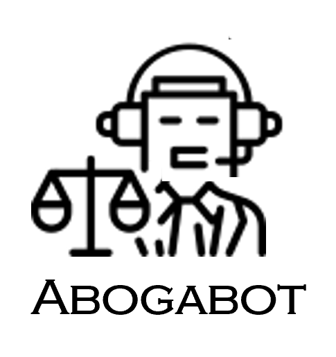

# FrontEnd-Mission-Intro
> Este repositorio contiene los elementos de la práctica 1 del programa launchx respecto a la parte inicial de todo proyecto, comenzando por definir los requerimientos del cliente, seguido de construir la buyer persona y segmentar un público objetivo. Posteriormente para el UX se realizan wireframes antes de realizar un diseño, con el objetivo de evitar errores y perder tiempo una vez que se comience con el UI.

## Abogabot

    

## Contenido disponible

- [Buyer persona](2%20-%20Buyer%20persona.md)
- [Público objetivo](3%20-%20Publico%20objetivo.md)
- [Wireframe UX](4%20-%20Wireframe%20UX.md)
- [UI](5%20-%20UI.md)

## Contenido pendiente

- Toma de requerimientos

